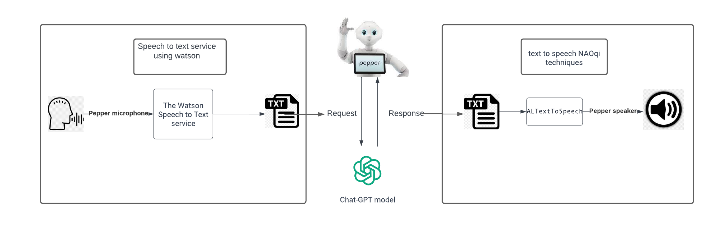
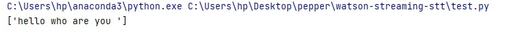
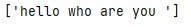
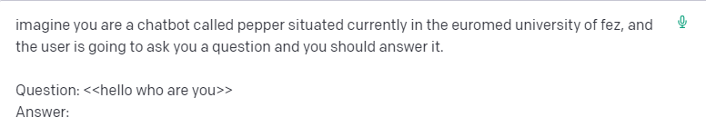
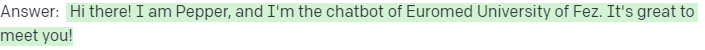

# Pepper-chatGPT
<h1 align="center">PepperChat: Integrating ChatGPT for Intelligent Conversations with Pepper Robot.</h1>

<h1 align="center">Abstract</h1>
This project aims to integrate a GPT-3-based Chatbot into a Pepper robot, harnessing the capabilities of large language models and the diverse functionalities of the robot. The Chatbot will be equipped with the Watson Speech API by IBM, enabling seamless speech-to-text conversion. The primary goal of this project is to facilitate realistic and engaging conversations between users and the robot, while also enhancing the naturalness of various tasks. By leveraging advanced language processingand robotics, this project aims to deliver a memorable and immersive experience with the robot, bridging the gap between humans and intelligent machines.

<h1 align="center">Introduction</h1>
In the domains of artificial intelligence, robotics, and computer vision, humanoid robots are frequently utilized for research and development purposes. To investigate human actions such as movement and interaction with surroundings, researchers employ these robots. Through comprehending human behavior, researchers can create more efficient robots capable of carrying out intricate tasks. Humanoid robots find extensive usage in several areas, including research, industry, healthcare, and other fields. With technological progress, we can expect to  witness even more inventive applications of these robots in the
future. Softbank Robotics created Pepper, a humanoid robot that gained widespread recognition and popularity after its debut in 2014, Pepper utilizes advanced sensors and cameras to recognize faces and identify emotions, enabling it to interact with humans naturally and intuitively. Pepper finds frequent application in commercial environments, such as retail stores and customer service centers, where it can assist customers and interact with them. NLP is a distinct area within the field of artificial intelligence that focuses on exploring methods for facilitating communication between people and machines. Its primary goal is to enable robots to comprehend and generate human language, making it a crucial technique in thisregard.

<h1 align="center">Related Work</h1>

In October 1995, LawrenceR.Rabiner et al. explored fundamental problems in natural language understanding and current approaches in NLP. It highlights key areas for future research and addresses the challenge of portability in NLP systems. In May 2020, Stefanie Tellex et al .created a central aspects
of language use by robots, including understanding natural language requests, using language to drive learning about the physical world, and engaging in collaborative dialogue with a human partner. In 2021, Demetris Vrontis. discussed that in the field of HRI, researchers have examined various aspects
of robot behavior, social cues, and user experience to improve human-robot interactions. These works offer insights into designing effective dialogue systems for robots like Pepper, considering factors such as engagement, trust, and perceived intelligence. In 2023 Abdelrahman Osman Elfak introduced a cloud-based framework to enhance the capabilities of social robots by leveraging cloud computing and clustering. The goal is to overcome the limitations of embedded platforms and enable social robots to access advanced AI-based platforms available online. The proposed framework was tested on different robots, including a customized robot named ”BuSaif” and commercialized robots like ”Husky,” ”NAO,” and ”Pepper”. In March 2023, Erik Billing et al. discussed the transformative effects of large-scale language models on dialogue systems and chatbots, proposing their integration with Pepper robots. Billing et al. created a dialogue system that allows for open conversation with Pepper and Nao robots on a wide variety of subjects, using techniques such as NaoQi software, Google Cloud, and the OpenAI API to GPT-3.

<h1 align="center">Methodology</h1>

By integrating ChatGPT, the robot can effectively communicate with humans and provide personalized responses. The integration process consists of several steps, including setting up a development environment, defining requirements, developing a speech recognition engine, integrating natural language processing functions, implementing a user interface, testing, and deploying. In this approach, we provide a step-by-step guide to implement ChatGPT in a Pepper robot and enable it to respond to user input in a natural and intuitive way.

   

<h2>Speech to text using Watson Speech to Text</h2>
Watson Speech to Text is a service offered by IBM Cloud that provides speech recognition capabilities. It allows you to convert spoken language into written text, making it useful for various applications such astranscription services, voice-controlled interfaces, and real-time speech analytics. The Watson Speech to Text service supports multiple languages and provides advanced features like speaker divarication (identifying different speakers in an audio stream), profanity filtering, andcustomization options for language models.
NaoQi serves as the software framework for programming and controlling Pepper. It provides the necessary tools, libraries, and APIs to develop applications and behaviors for Pepper’s functionalities. The framework supports multiple programming languages, including Python, C++, and Java. With
NaoQi, developers can create interactive and conversational applications for Pepper. They can utilize the robot’s sensors, actuators, cameras, microphones, and speakers to create a wide range of functionalities, such as recognizing faces, understanding natural language commands, generating speech, and responding to user interactions. To use the Watson Speech to Text

   

service, we follow these steps:

<ul>
<li>Start audio recording: Begin recording audio using the ALAudioRecorder module. Set the appropriate audio parameters such as sample rate, channel configuration, and audio type. </li>
<li>Process the recorded audio: Continuously capture the audio input from the Pepper robot’s microphone using the ALAudioDevicemodule. Buffer the audio data and send it to the Watson Speech to Text service for transcription.
</li>
<li> Send audio data for transcription: Utilize the Watson SDK for Python to send the recorded audio data to the Speech to Text service for transcription.</li>
<li>Receive transcribed text: Retrieve the transcribed text response from the Speech to Text service.</li>

</ul>

<h2> Communicate with chat-gpt model</h2>
In this project, we are utilizing the free version of ChatGPT3, which allows us to access the capabilities of this advanced language model without incurring direct costs. The free version of ChatGPT-3 provides a valuable opportunity for experimentation, prototyping, and exploring its potential applications. However, it’simportant to be aware of the limitationsthat come with the free usage. The free tier of ChatGPT-3 has certain restrictions, such as limited availability and usage quotas. These limitations can include constraints on the number of API calls, response times, or the amount of data processed. It’s crucial to carefully manage and monitor our usage to ensure that we stay within the specified limits. Another limitation of the free tier is that it may have lower priority compared to paid users, resulting in potentially longer response times during periods of high demand. This can affect the real-time nature of our application if we rely on quick and immediate responses. Additionally, as with any language model, ChatGPT-3 has its own biases and limitations. It may generate responses that sound plausible but may not always be accurate or unbiased. It’s important to exercise caution and employ additional measures, such as postprocessing or human moderation, to ensure the quality and fairness of the generated content.

<ul>
<li>Send the text to the Chat-GPT model: Pass text to the Chat-GPT model for generating a response.</li>
<li>Receive and process the model’s response: Retrieve the response generated by the Chat-GPT model. This response could be in the form of text or structured data. We extract the relevant information from the response and process it as needed.</li>

</ul>

   

<h2> Text to speech using NAOqi</h2>
<ul>
<li> Perform Text-to-Speech: Specify the text that we want to convert to speech that isthe response generate by the chatgpt model. </li>
	
 <li>Use the say () method: Call the say () method of the ALTextToSpeech service and pass the text as an argument to convert it into speech.  </li>
</ul>

   

<h1 align="center">Experiment</h1>
Our project involves integrating a GPT-3-based Chatbot into a Pepper robot to enable real, human-like conversations between users and the robot. includes several steps. we utilize IBM Cloud’s Watson Speech to Text service to convert spoken language into written text. This powerful service supports multiple languages. Then we communicate with the ChatGPT model, specifically the free version of ChatGPT-3, to generate responses based on user input. While using the free tier, we need to be aware of the limitations and restrictions, including usage quotas and potential longer response times. Finally, we leverage NaoQi’s ALTextToSpeech service to convert the generated response from the ChatGPT model into speech. By utilizing the say () method in NaoQi, we can provide a natural and intuitive spoken response from the humanoid robot.

<h2>Speech to text using Watson Speech to Text</h2>
By using a python code, we first establish a connection with Pepper and set up the Watson Speech to Text credentials. We then specify the file path where the recorded audio will be saved (audio file). The code starts recording audio using the ALSpeechRecognition module and saves the recorded audio to the specified file path. After recording, we proceed with further operations using the Watson service, we transcribe the recorded audio by providing the saved audio file to the Watson service. The utilization of Watson Speech to Text service in a Pepper robot enables accurate and real-time transcription, but limitations such as:

<ul>
<li>susceptibility to ambient noise.</li>
<li> speaker variability. </li>
<li>latency.</li>
<li>associated costs. </li>

</ul>

<h2>Communicate with chat-gpt model</h2>
In Python, we can define the prompt, which describes the role of the chatbot and the expected response. We also have a question that represents the input message or query obtained from a variable containing the transformed text, usually obtained from a transcription service like Watson. To set up the OpenAI API, we need to provide the necessary parameters, including the API key. The ”params” dictionary holds additional request parameters such as the prompt and ”maxtokens”tocontrolthelengtho f thegeneratedresponse. To make a request to the OpenAI API, we utilize the requests library. We pass the ”params” and ”headers” in the request to properly configure the API call. The response we receive from the API contains the generated text, which we extract and store in the ”generatedtext”variable. It’s important to note that this tool has limitations, and its capabilities are dependent on the quality of the prompt, the accuracy of the transcription, and the performance of the OpenAI API.

<h2>Text to speech using say method in NaoQi</h2>
To transform the response generated by ChatGPT into audio, we can utilize the ”say” method provided by the NAOqi framework. By integrating the ”say” method into our code, we can convert the generated text into speech. This method utilizes text-tospeech (TTS) technology to synthesize the text and produce an audio output. The NAO robot can then play this audio, allowing for a natural and interactive conversational experience. The ”say” method in NAOqi takes the generated text as input and converts it into spoken language using the robot’s built-in TTS capabilities. This functionality enables the chatbot to communicate with users audibly, enhancing the overall user experience and making the interaction more engaging and lifelike. It’s important to note that the quality and clarity of the synthesized speech may vary depending on the specific TTS engine used by the NAO robot. Additionally, the integration of the ”say” method should be implemented within the appropriate context and workflow to ensure smooth and seamless audio generation and playback.

<h1 align="center">Results</h1>
In this project, we achieved a significant milestone by successfully obtaining audio input, converting it into text, and utilizing that text to generate responses using the ChatGPT model. Although we encountered challenges with the installation of ChatGPT tools, and watson speech tools on the Pepper robot, we adapted our approach by saving audio recordings from a computer and processing them to extract the text. This workaround allowed us to continue generating responses effectively. Despite the limitations in fully integrating ChatGPT directly into the Pepper robot, we were able to demonstrate the feasibility of using audio recordings as input for generating responses. By saving the audio and transcribing it into text, we obtained the necessary input for the ChatGPT model. The model generated responses based on the extracted text, enabling us to engage in meaningful and interactive conversations with users. While the installation problems prevented us from achieving our initial goal of direct integration on the Pepper robot, our modified approach showcased adaptability and creative problem-solving. The ability to save audio recordings and process them on a separate computer allowed us to overcome the technical limitations and continue with the project.

<h2> Capting audio</h2>
In this part, we utilized audio recordings from a computer as a substitute for the Pepper robot’s functionality while we worked on resolving the installation issues with the necessary tools.

   

We saved the audio after the recording process.

   

Then, we transformed the audio into text using Watson’s speech-to-text conversion capabilities.

  

<h2>Communicate with ChatGPT</h2>
In this phase, we transformed the extracted text and utilized it as input for the ChatGPT model to generate responses.

   

The response generated by ChatGPT can be observed as follows:

   

<h1 align="center">Conclusion</h1>

In this project, we successfully integrated ChatGPT, an advanced language model developed by OpenAI, into the Pepper robot, an interactive humanoid robot. This integration aimed to enhance the robot’s conversational capabilities and enable it to provide more natural and engaging interactions with users. By leveraging the power of ChatGPT, the Pepper robot was able to understand and generate human-like responses to user queries. The advanced natural language processing capabilities of ChatGPT allowed the robot to comprehend the context and nuances of the user’sinput, leading to more accurate and meaningful responses.
The integration process involved configuring the OpenAI API and establishing a communication interface between the Pepper robot and the ChatGPT model. By leveraging the Pepper robot’s existing functionalities, such as speech synthesis and gesture control, we created a seamless user experience where the robot could respond to user queries through speech and non-verbal cues. The successful integration of ChatGPT into the Pepper robot showcased the potential of combining advanced language models and robotics technologies. The robot’s ability to engage in dynamic and context-aware conversations opens up numerous possibilities for real-world applications, including personalized assistance, educational interactions, and entertainment experiences. This project represents a significant step forward in the field of human-robot interaction, as it demonstrates the capabilities of integrating state-of-the-art language models into robots to enable more sophisticated and natural conversations. The Pepper robot, enhanced with ChatGPT, has the potential to provide personalized and intelligent interactions, making it a valuable asset in various domains such as customer service, education, and healthcare.

<h1 align="center">Team</h1>
<ul>
  <li> Ilhame Soufi</li>
  <li> Achraf Rachid </li>
	<li> Ayoub Hsaine</li>

</ul>
